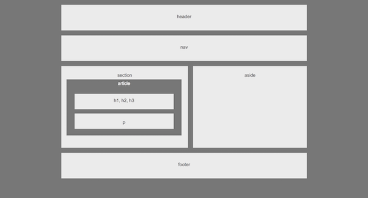
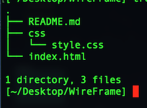

## Understanding CSS/ HTML

https://robydoidao2006.github.io/WireFrame/

What the Page looks like

## Aditional Information
- In this little project, we created a wrapper, inside the wrapper we have a header, a nav, a section; inside the section we have a contariner that is holding an article and two smaller containers, also an aside container & a footer... I know it got pretty inception. The whole point of this project is to understant positioning of elements using css/html.

## This project was built using
- html
- css

## How to Run this project localy
- Clone / Download the repository.
- Unzip the file.
- Drag and drop the unzip folder on a text editor of your choice.
- Look for the index.html and get it to display on the text editor, right click and open on browser(or coomand b)
- Your default browser should open and load the Game automatically.

## Folder Structure

## Future Improvements
- Make the project Responsive. So it ajusts to the size of the brower viewing angle.
